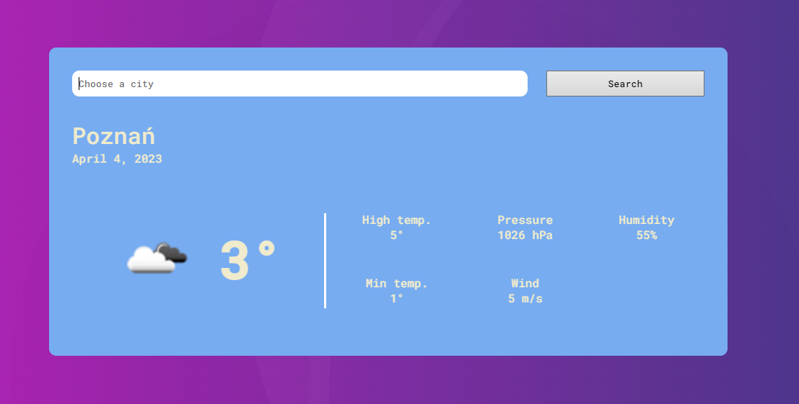

# Weather forecast 
### Django, Html, CSS

App showing the current weather in a given location. Data is taken from [OpenWeatherMap](https://openweathermap.org)



## Installation 

1. The first thing to do is to clone the repository:
    ```
    git clone https://github.com/matt064/current_weather_forecast.git
    ```

2. Create a virtual environment to install dependencies in and activate it:
    ```
    python -m venv "path_to_catalog"'
    venv\Scripts\activate'
    ```

3. Then install the dependencies:
    ```
    (venv)pip install -r requirements
    ```

## Start app

```
python manage.py runserver
```

ENJOY the app!